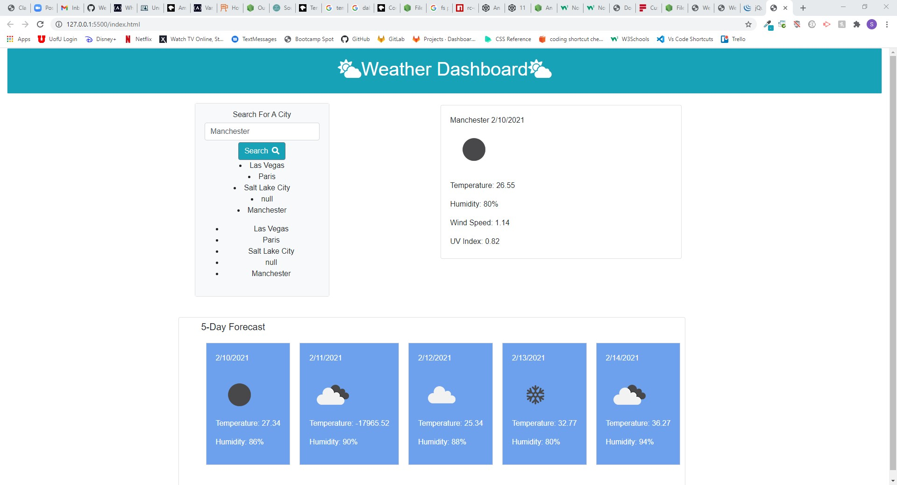

# Weather-Dashboard

##Description
Create a weather dashboard using an api that will provide weather details about a city. The dashboard contains a city search feature with current weather information along with a five day forecast.

##Technologies Used
Bootstrap
JavaScript
Jquery
OpenWeatherMap
Font Awesome

##Resources
Week 6 Activity 5
W3 Schools
https://api.jquery.com/
Stack Overflow
amoung other online aides

## Screen Shot 
